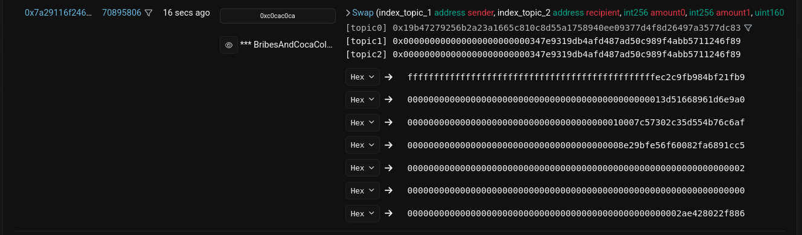
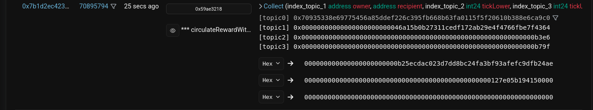
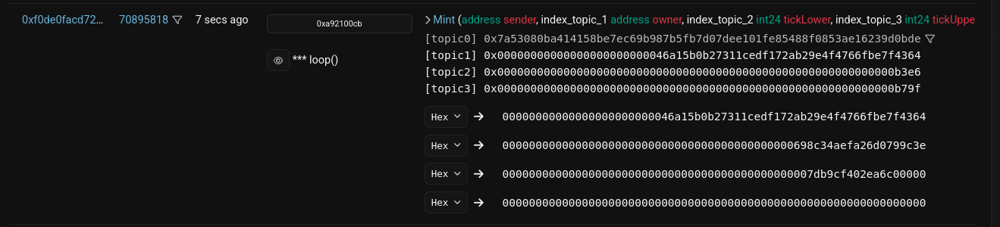
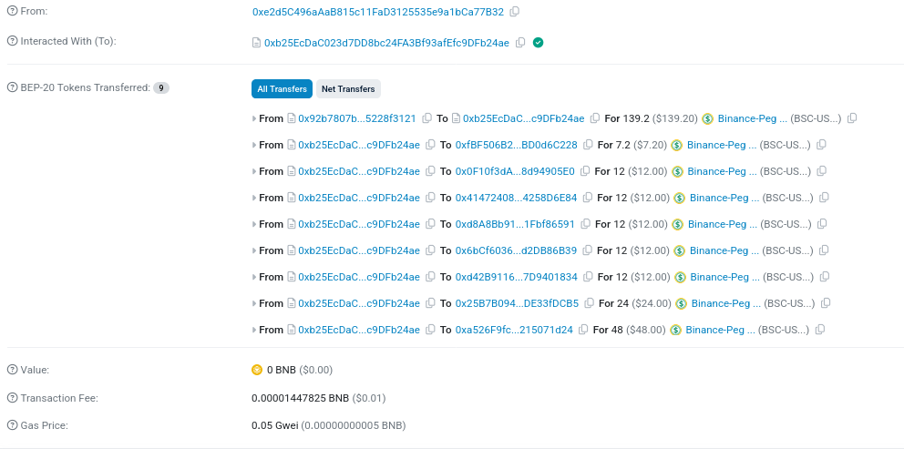
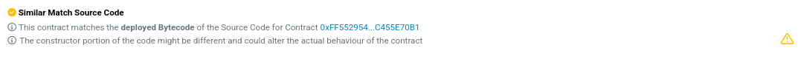
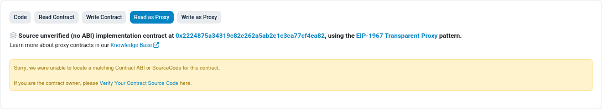

Every deposit is sent to `0xFCc442275A2620E40F17598F9987F320fB57526e`. From there, the `loop()` function must be manually triggered by someone with the **OPERATOR_ROLE**. When triggered, the function increases liquidity for the configured `tokenId` on PancakeSwap.

However, it currently appears that `loop()` is being triggered by a bot, because refreshing the website periodically shows the token balances changing.

Some Major concerns here are:

1. **If the `loop()` function is never triggered**, the deposited funds will remain at the contract address. Since the admin holds the authority, they could later withdraw these funds.
2. **The DEFAULT_ADMIN_ROLE has the permanent ability to update the `tokenId`.** If this is changed to an unknown token, all future `loop()` operations will be redirected there. This would effectively route funds to a different contract we can't track or verify.

A better approach would be to hardcode all acceptable token IDs inside the contract (similar to how USDT and PancakeSwap addresses were fixed). This would ensure that even if the admin updates the `tokenId`, it can only be changed to a known and verified option. Additionally, if `loop()` is never triggered, funds remain safely locked, rather than exposed to administrative withdrawal.







*The above screenshots are from the logs of the Bitnest contract `0x92b7807bF19b7DDdf89b706143896d05228f3121`.* 

There may be more functions in the contract, but these are the key ones I focused on.

We already understand the `loop` function, which exists in the contract at this address: `0xFCc442275A2620E40F17598F9987F320fB57526e`. Its job is to move funds from that address into one of the Bitnest tokens, and behind the scenes it does this by calling PancakeSwap’s `Mint` function. So its purpose is clear and verifiable.

Next is the `circulateWithdrawReward` function. Internally, it uses PancakeSwap’s `Collect` function, which basically means it pulls money out from the Bitnest vault. Unlike `loop`, we don’t know the exact address of the contract that triggers this action, so we can’t fully trace everything it does. But we know that, like `loop`, it is being activated by someone with admin control.

Lastly, there’s the `BribesAndCocaColaZ12397269` function, which internally uses the PancakeSwap `Swap` function. Again, we don’t know the exact address where this function is defined. Also, giving a function such a random and unprofessional name is unusual and raises suspicion.

------

The administrative structure of the system becomes even clearer when examining the payout activity. In the transaction logs for the `circulateWithdrawReward` function, we see repeated interaction with the address `0xb25EcDaC023d7DD8bc24FA3Bf93afEfc9DFb24ae`. This address appears to serve as an Intermediate Payout Contract, meaning it receives funds from the main Bitnest vault and then distributes them in batches to individual users.



When looking at how funds move between the contracts, it looks like things might be handled in a centralized way. For example, in the transaction
 `0x3e6fb292f26fcdc7615f24f551eb2aa9ed43f14e389b7bec54cdf58c4e6ea0ac`, the contract at
 `0xb25EcDaC023d7DD8bc24FA3Bf93afEfc9DFb24ae` receives **139.2 USDT** from what seems to be the main Bitnest vault at
 `0x92b7807bF19b7DDdf89b706143896d05228f3121`. Right after that, the money gets split up and sent out to several individual users.

From this behavior, it gives the impression that payouts might not be happening automatically on-chain. Instead, the contract at
 `0xb25EcDaC023d7DD8bc24FA3Bf93afEfc9DFb24ae` kind of looks like a payout distributor that only gets funded when someone triggers the withdrawal process. It’s not conclusive on its own, but this pattern definitely raises questions about how much of the system is automated versus handled manually behind the scenes.


*sample of how `0xb25EcDaC023d7DD8bc24FA3Bf93afEfc9DFb24ae` is always busy with making out payouts, but at intervals receives more funds from Bitnest vault.*

It looks like the `circulateWithdrawReward` function isn’t actually written inside the contract at
 `0xb25EcDaC023d7DD8bc24FA3Bf93afEfc9DFb24ae` even though this contract is clearly the one used to process payouts. Instead, this contract behaves  like  *proxy*: whenever someone calls a function here, the request is forwarded to a different contract where the real logic happens that contract is located at
 `0x2224875a34319C82C262a5AB2c1C3ca77Cf4ea82`.



BscScan even gives a warning saying that the behavior of the `0xb25EcDaC023d7DD8bc24FA3Bf93afEfc9DFb24ae...` contract can vary depending on which parameters are passed to it. Since it forwards instructions to another contract, whatever parameters the deployer sets will directly affect how the payout logic works behind the scenes.



Looking at BscScan, we can confirm that the main code, the real implementation of the functions, lives in the contract at
 `0x2224875a34319C82C262a5AB2c1C3ca77Cf4ea82`.


However, the issue here is that the contract code at that address is not written in readable Solidity, it shows only raw bytecode, We cannot easily see or verify what the payout functions actually do.

Even though the logic isn't human-readable, we can still notice patterns. For instance:

> ```
> 8063 **c54e44eb** 116100ab57
> 8063 **cdb1327d** 1461068457
> 8063 **59ae3218** 1461045957
> ```

The last one (`59ae3218`) matches the function signature hash for `circulateWithdrawReward`, which suggests that this function exists inside this hidden logic.

Beyond that, it's very hard to go deeper because bytecode is extremely difficult to reverse-engineer back into readable code.

