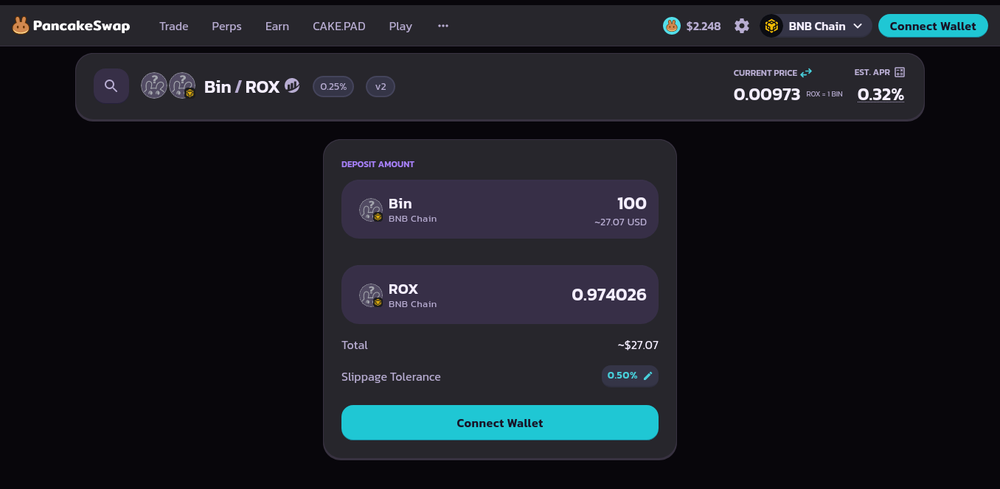

### **BinToken - ** `0x586a74A6c7375A507e3E3DdFeF891cB9D2477777`

The **BinToken** contract is a simple, standard digital asset that provides a fixed supply of 1 billion "Bin" tokens and uses the recognized ERC-20 framework to ensure reliable, auditable, and secure transfers of value on the blockchain.

We could think of this like a ledger, for every user who holds/has once held this token.

> | address       | balance |
> | ------------- | ------- |
> | 0x0000john... | 1000    |
> | 0x0000doe.... | 500     |
>
> john has 1000 tokens; doe has 500 tokens.

it also implements another feature `allowances` where you can give someone approval to spend a limited amount of your token.

> | owner (address) | spender (address) | allowance |
> | --------------- | ----------------- | --------- |
> | 0x0000john...   | 0x0000doe...      | 300       |
> | 0x0000doe....   | 0x0000john...     | 100       |
>
> john gives doe access to spend up to 300 of his tokens; doe gives john access to spend up to 100 of his tokens.

it defines some functionalities, which allows you to transfer from one address to the other, check balances of addresses, give someone some allowance to a wallet, increase allowance given to someone, decrease allowance given to someone, being able to spend from the allowance.

This token was deployed fully decentralised with the deploy initially having all 1billon tokens which is standard practice.

**RoxToken - ** `0xDc6B656e1E7b11990F422A066c69091EaE373333`

The **ROX Token** is the native, core, and functional asset of this entire ecosystem. It operates as a reward-generating asset built on the Binance Smart Chain.

ROX was deployed with an initial supply of **`2100 × 10²²`**, with the entire supply initially allocated to the deployer.

Upon deployment, a liquidity pool was created pairing **ROX** with **BIN**, establishing the foundational market and reward flow between both assets.

ROX was initially deployed as a centralized wallet, but later ownership was given up.

ROX is designed with a unique fee-on-transfer mechanism, giving it a much more complex set of responsibilities than a standard ERC20 token:

- **Transaction Fees:** ROX imposes dynamic and differentiated taxes (Standard Fee, Sell Tax, and Profit Tax) on every transfer, which serve as the project's primary revenue source.

- **Engine for Rewards:** Every fee collected in ROX is immediately funnelled into a conversion system, where it is swapped for the reward token, **BIN**.

- **Ecosystem Distribution:** The resulting BIN tokens are then automatically distributed to three distinct classes of participants: **Dividend Holders**, **LP Providers**, and **Nodes**.

  1. **Dividend Holders:** In order to participate in this, you need to hold some ROX coins. This is the simplest reward stream: the moment you buy or receive ROX, the smart contract's internal **Dividend Tracker automatically adds your wallet** to the list of eligible participants. You do not need to stake, register, or sign up for anything, you are rewarded simply for being a long-term holder. Your share of the rewards, which are funded by the special **Profit Tax** on sales, will be calculated based on the amount of ROX you hold.

     The **Dividend Tracker** is essentially a separate, automated ledger that runs alongside the main token. Its job is to precisely record every ROX transfer to maintain a historical snapshot of everyone's balance. When a payout is triggered, it uses this history to calculate exactly how much of the new `BIN` reward pool each holder is owed, ensuring that your individual rewards are secured and waiting for you to claim when you choose.

  2. **LP Providers:** In order to participate in this you need to buy the liquidity pair on the decentralized exchange, **PancakeSwap**, which hosts the **ROX/BIN trading pool**. This means you must deposit an equal **value** of both your ROX tokens and BIN reward tokens into the pool. In exchange, you are given special **LP Tokens** (Liquidity Provider Tokens) which act as your receipt. These LP Tokens automatically register you with the smart contract, making you eligible to earn a portion of the **Standard Fee** collected from every single buy and sell transaction on the platform. This reward stream incentivizes users to provide the necessary assets to keep the ROX market stable and liquid.

     

  3. **Nodes:** This is a separate centralized contract, where the admin is able to **selectively add or remove wallet addresses** to a whitelist that functions as the official list of Nodes. This is not a public reward stream; it is designed to reward dedicated partners, major ecosystem contributors, or core infrastructure providers who are essential to the project's long-term success. Nodes receive their own fixed share of the **Standard Fee** from all transactions, which is paid out in **BIN** like the other reward streams. Because the list is controlled by the project admin, it ensures that this particular reward pool only goes to the entities who are actively fulfilling the strategic needs of the project.

  
  
  ### The Transfer Function: The Heart of the System
  
  The `transfer` function is the code that is called every single time a user sends ROX from one wallet to another, or when they buy or sell on an exchange. It is called by **your wallet** (the sender of the transaction) every time you initiate a move. Unlike a standard token that just moves coins, the ROX `transfer` function first determines which taxes to apply, looking at whether it’s a simple wallet-to-wallet transfer (the standard fee) or a large sale (triggering the special profit tax). It then immediately **deducts the tax in ROX coins** from the sender's amount and transfers the remaining tokens to the recipient. The accumulated fee tokens are held in a special **Fee Pool** within the smart contract. Once this pool hits a specific balance, the contract automatically swaps those ROX tokens for **BIN** on the open market, and this BIN is then instantly distributed to the three reward streams as written above, completing the self-sustaining cycle.

**NODE Manager - ** `0x46Ab18814acE2351EFe5fF19dd02fe22DEA0A5BE`

This contract, known as the **NODE Manager**, is the third and most centralized reward stream. It is a separate ledger designed specifically to track and distribute rewards to a select group of approved contributors. Unlike the Dividend Holder system, the **NODE Manager is managed by the project administrator**, who is the only party capable of adding or removing official Node addresses. When the main ROX token sends rewards, which always arrive as **BIN** tokens, this contract calculates the share for each approved Node based on the `totalRewards` it receives. This ensures that only whitelisted partners receive this specific stream of funding. Finally, each Node is responsible for calling the `claim()` function to withdraw their accumulated BIN rewards when they choose.

**POOL - ** `0x09774dED63D8CC41a835a802E21eDFeb80814d6B`

The **Pool** contract acts as the dedicated Staking Vault for a specific investment program within the ecosystem. While the ROX token handles transfer fees, this contract manages user deposits and rewards using stablecoins, specifically **USDT**, and connects directly to an external **DAO** (Decentralized Autonomous Organization) `0x8e789a939E8e38F2D5E2DD08273aB22771547b73` contract.

**Mechanism**

- **Staking and Locking:** Users deposit **USDT** (a stablecoin) into the Pool for fixed periods (1, 15, or 30 days). The contract tracks each individual deposit as an "Item," recording the amount, the lock-up period, and the expected interest. A user's total active stake cannot exceed a set maximum. 
- **Two-Step Process (Pre-Stake and Stake):** When a user deposits USDT (`stake`), the funds enter a waiting queue (Pre-Stake). A separate function (`_processPreItem` and `processPreItem`) is called to move items from the queue into the official Staked status, based on daily and minute-by-minute caps to control the flow of new capital.
- **Liquidity Generation:** When a deposit moves from pre-stake to staked, a portion of the user's USDT is used to automatically execute a complex set of swaps (USDT to BIN, then BIN to ROX) and then adds **ROX/BIN liquidity** to the market. This means user deposits are actively used to deepen the liquidity of the ecosystem's native tokens.
- **Claiming:** After the user's lock-up period expires, they can call the `claim` function. This function performs a reverse transaction: it sells off accumulated ROX tokens, converts them back to the necessary USDT, and then sends the initial principal plus the accrued profit (interest) back to the user. A portion of the profit is automatically sent to the **DAO contract** for other ecosystem uses.

In conclusion, the **Pool** contract acts as an investment layer that takes stablecoin deposits from users, uses a portion of those funds to bolster the native ROX/BIN liquidity, calculates compounded interest, and then handles the final payout after the lock-up period. It was initially deployed as a centralized contract but ownership was given up later.

**DAO Manager - ** `0x8e789a939E8e38F2D5E2DD08273aB22771547b73`

The **DAO Manager** is the permanent administrative core of the Pool. Every time a user stakes or claims, the DAO acts as the master record keeper for the system, tracking who is staking, who invited them, and how the profits are being split. The DAO's address is secured by a **Proxy Contract** . This allows the administrator to update the underlying code to change certain features like **adjusting reward formulas** or **modifying governance rules** to the staking system.

The Hidden Implementation may have more functions, but the **Pool** contract only interacts with the DAO using the following specific functions:

`inviterOf(address user)`: Queries the DAO to check the wallet address of the user's referrer (inviter).

`start(uint startTime)`: Notifies the DAO when the official staking program has begun.

`stakeInBy(...)`: Reports to the DAO when a user's deposit has moved from the waiting queue to the active staking period.

`claimBy(...)`: Reports the final transaction details to the DAO when a user successfully claims their principal and profit.
